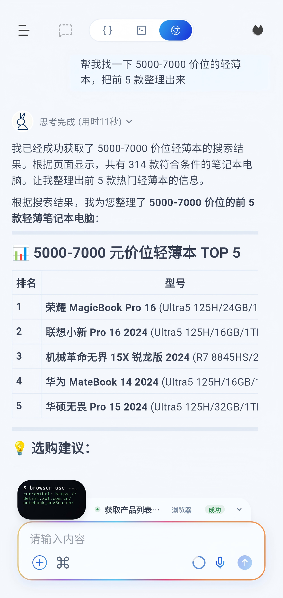
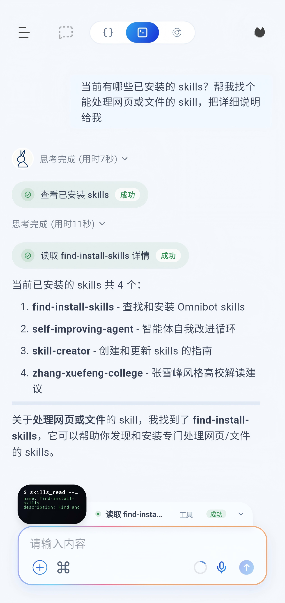
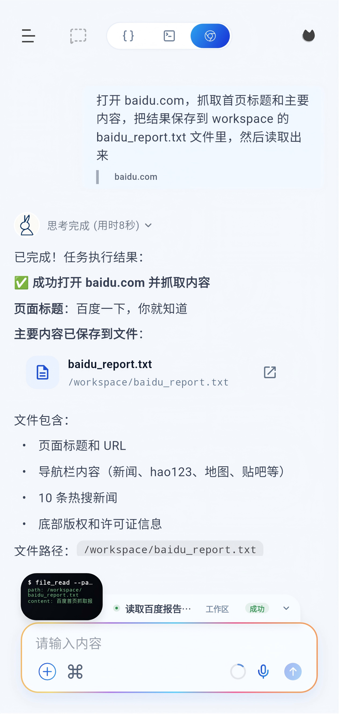
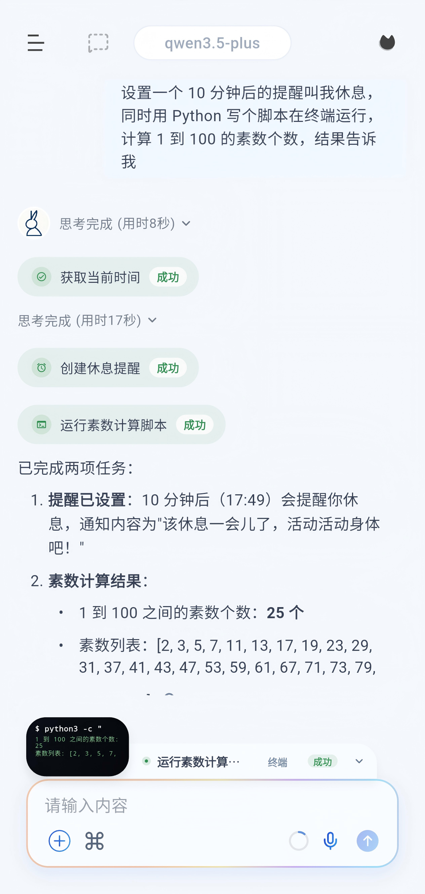
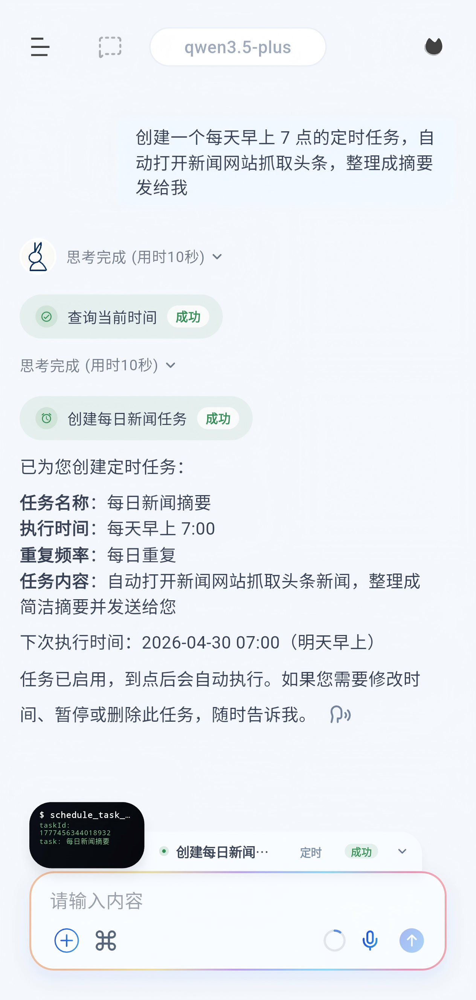
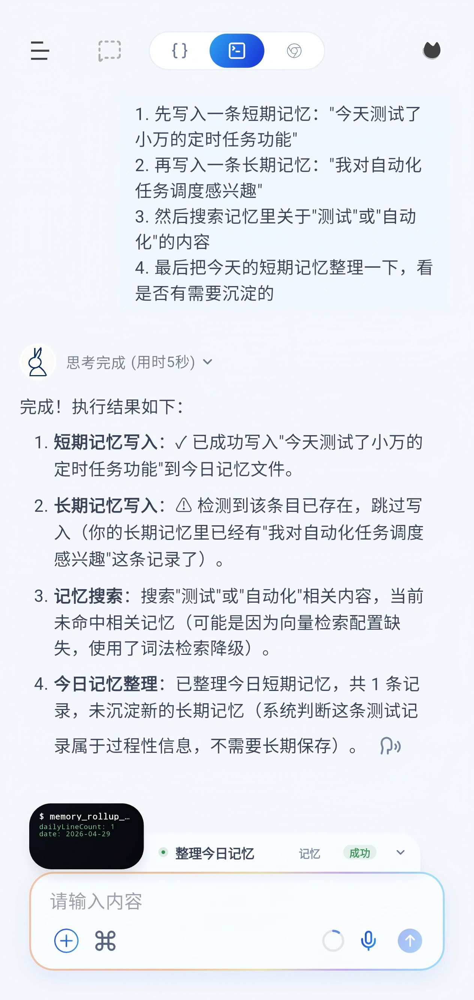
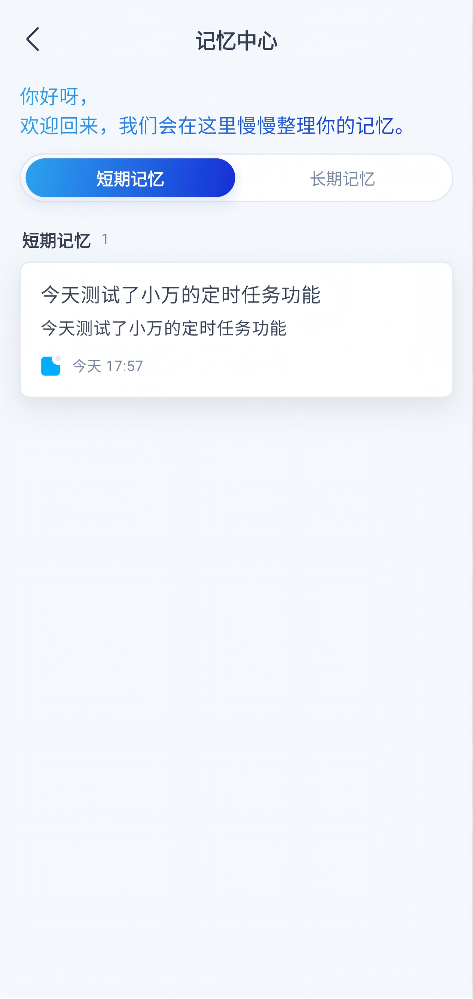
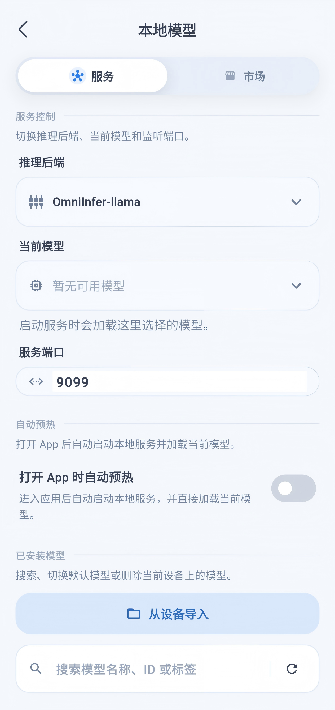
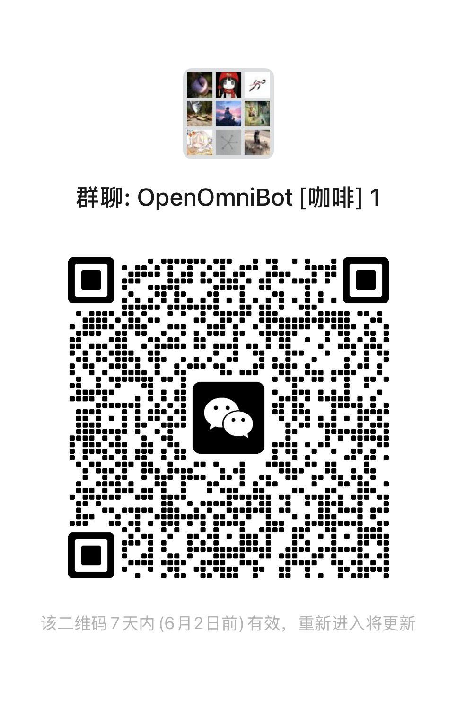

# 为 AI 长出手：全能 Agent 小万上线

**AI，不该只困在聊天框里。**

小万（OpenOmniBot）不是只会聊天的 AI，而是一个真正**住进你手机、长出手的端侧 Agent**。

从**感知、决策到执行**，它能像人一样看懂屏幕、调用工具、搞定琐事。

告别纸上谈兵，小万，真正替你接管现场。

---

## ⚡ 01 读懂屏幕，接管任务

**懂你所言，也看你所见。**

凭借强大的视觉模型（VLM），小万能读懂当前页面与上下文，无需在不同 App 间来回跳转、复制粘贴，它会自动提炼重点，并代你把操作往前推进。

---

## 🛠 02 调动工具，包揽执行

真正的执行力，源于不断生长的能力系统。小万不纸上谈兵，只交出结果：

- **Skills & MCP**：一键接入插件，无缝调用远端工具。
- **浏览器 & Workspace**：打通全网信息，文件处理一气呵成。
- **系统与终端**：调度闹钟日历，甚至内嵌 Alpine 极客环境。

告别那句敷衍的“我明白了”，它直接替你“搞定”。

---

## ⏱ 03 托管时间，自动流转

真正的智能，无需时刻紧盯。

小万的“定时任务”绝非简单的闹钟提醒，而是一套能跑通 **VLM 视觉任务**与 **Subagent 流程**的自动化引擎。
不管是早间的资讯整理，还是出门前的路况规划，它都会在对的时间，自动做对的事。

你只需设好规则，把过程交给它。剩下的，只管验收结果。

---

## 🧠 04 沉淀碎片，一语唤醒

真正的助理，拥有过目不忘的本领。

小万内置**长短期记忆系统**。无需手动分类，它会默默替你妥帖安放那些划过的文章与闪过的灵感。

需要时，一语精准调取。

**等你回头寻找，它们不必再消失一次。**

---

## 🔒 05 扎根端侧，守护隐私

小万全面支持本地模型推理，完美兼容 **MNN** 与 **llama** 后端。

断网依然可用，敏感数据绝不出端。

**把助理真正留在身边，让信任长期成立。**

---

## # 小万上线：即刻交办，即刻生活

AI 的价值不在于口号，而在于实打实的替你分担。

现在，交给它一个小任务，替你走完最琐碎的那段路，感受“无需动手”的效率革命。

**把事交给小万，你先去生活。**

---

<h2 id="community">其他</h2>

感谢 [LINUX.DO](linux.do) 等社区开发者对 OpenOmniBot 的支持。

特别感谢这些优秀的开源项目：

- https://github.com/RohitKushvaha01/ReTerminal
- https://github.com/OpenMinis

<table align="center">
  <tr>
    <td align="center">
       
      <b>WeChat Group</b>
    </td>
  </tr>
</table>

Discord Community：[加入 Discord 社区](https://discord.gg/WnBvBXgykD)
